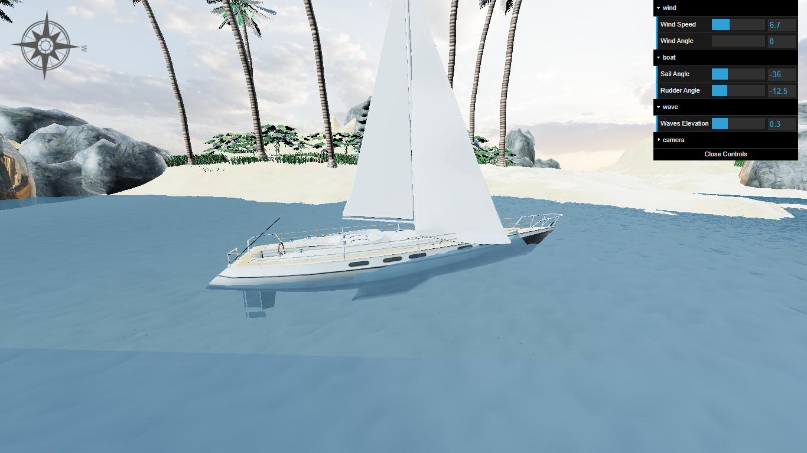

# Sailboat Simulation

This project simulates the physics and behavior of a sailboat, accounting for wind and water forces, drag, and wave resistance for a realistic sailing experience. The simulation uses Three.js and GLSL for rendering, along with HTML, CSS, and JavaScript for structuring and styling.
### [Vide Presentation](https://www.facebook.com/100027830925011/videos/3360913594218422/)  
## Project Overview
### This simulation project models the sailboat's interactions with the environment, including:

1. **Wind Forces on the Sail:** Lift and drag from wind impacting the sail.
2. **Water Forces on the Keel:** Lift and drag from water interacting with the keel.
3. **Water Viscosity Resistance:** Resistance due to water viscosity.
4. **Wave-Making Resistance:** The resistance caused by wave creation.
5. **Air Drag on the Hull:** Drag from air resistance on the boat's hull.
6. **Forces on the Rudder:** Lift and drag on the rudder, generating torque for rotation.
7. **Sail and Wind Angle:** The sail's angle relative to the wind, affecting boat movement direction.
8. **Collisions:** Interaction with surrounding objects.
9. **Wave Simulation:** Custom GLSL shaders simulate the ocean for precise wave impacts on the boat.

## Features
* **Realistic Physics:** Accounts for drag, lift, and torque on various boat parts.
* **GLSL Ocean Rendering:** Hand-crafted ocean simulation in GLSL for accurate wave interaction.
* **Interactive Control:** Simulate changes in wind direction and speed for dynamic conditions.

## Setup
Download [Node.js](https://nodejs.org/en/download/).
Run this followed commands:

``` bash
# Install dependencies (only the first time)
npm install

# Run the local server at localhost:8080
npm run dev

```
#
### Boat Simulation Interface


